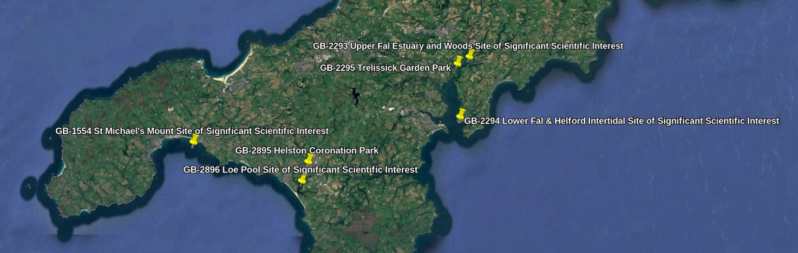
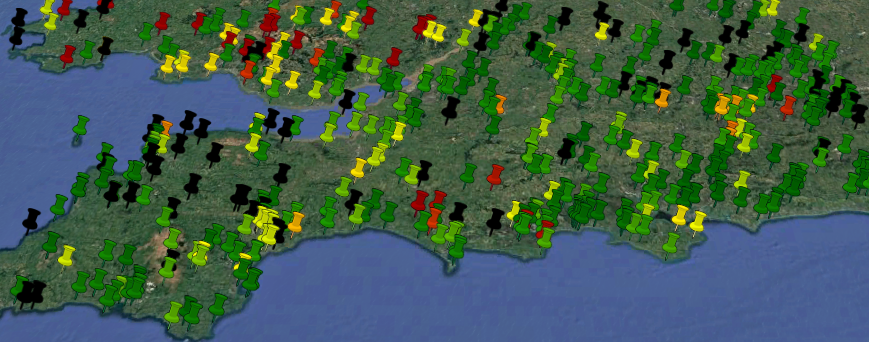

# POTA Unactivated Park Finder

The POTA Unactivated Park Finder (aka `newparks.py`) is a simple Python script that queries the Parks on the Air API to
find all parks that have never been activated, and produces a KML file of them that you can view in e.g. Google Earth.



There is also an expanded version, `parksbylastactivated.py`, which produces a KML file of all parks, coloured by the
time since last activation on a scale of red (many years ago) to green (today), using black to represent never-activated
parks. This might help you find some extra parks that, while they *have* been activated in the past, could do with some
love.



## What?

[Parks on the Air](https://parksontheair.com/) is an Amateur Radio activity where radio operators set up portable
stations in country parks, nature reserves, etc. to enjoy the great outdoors alongside their hobby.

There is a set list of parks world-wide which count for the program, which is regularly updated to include new locations
by a team of volunteers.

"Activating" a park consists of going there, setting up a portable radio station, and making at least 10 contacts with
other radio stations around the world, following the [POTA Rules](https://docs.pota.app/docs/rules.html).

This software helps POTA activators find new parks that no-one has ever activated before, hopefully finding interesting
new places to try setting up a radio station!

## Usage

Usage with `venv` and `pip` on Linux is recommended, but it will work fine wherever you use Python and however you like
to manage it.

A complete example for Debian & derivatives such as Ubuntu:

```bash
sudo apt install python3 python3-pip python3-venv
git clone https://github.com/ianrenton/newparks.git
cd newparks
python3 -m venv .venv
source .venv/bin/activate
pip install -r requirements.txt
python3 newparks.py
deactivate
```

Then open the resulting `newparks.kml` in [Google Earth Pro](https://www.google.com/intl/en_uk/earth/about/versions/#download-pro) (desktop), [Google Earth](https://earth.google.com/web/) (web) or another KML
viewer of your choice.

The use of `parksbylastactivated.py` is similar, but here we have to do additional requests to the POTA API to get the
last activated date, so to spare their servers we don't want to do this for every park in the world.
`parksbylastactivated.py` therefore takes a single parameter, which is your Maidenhead grid locator. It will then fetch
only parks within 1 degree latitude and longitude of you. So for example:

```
python3 parksbylastactivated.py IO90br
```

The resultant `parksbylastactivated.kml` file can be viewed as above.

## Warning

There may be reasons why a particular park has never been activated, such as it being closed but not yet removed from
the system, a change of ownership, unclear legality about amateur radio operations in the park, etc. You should still do
your own research to find out if it is possible and legal to activate a park, regardless of whether it appears within
this software or on the POTA website.

This software makes a number of queries to the "public but unofficial" POTA API. It caches the result for one day, to
avoid overloading the servers with repeated requests. Please do not abuse the API by hammering it with an undue number
of requests.